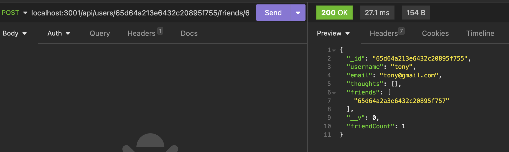
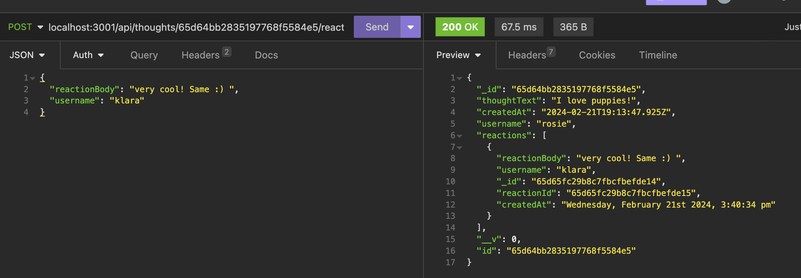
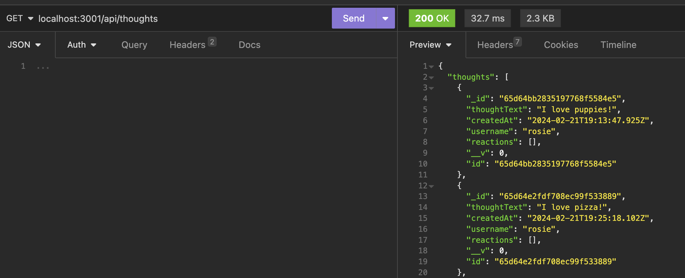
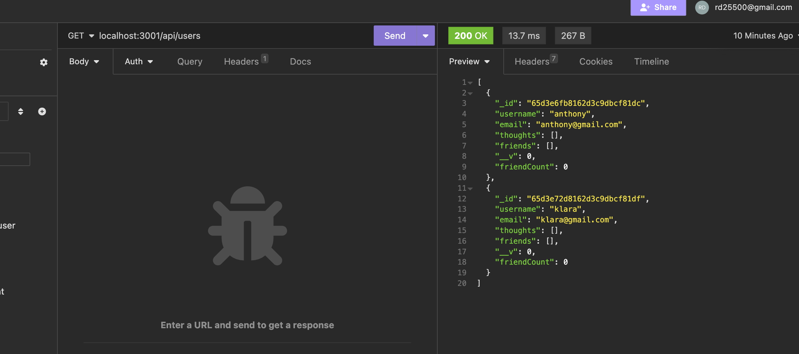

# NoSQL-Social-Network-API

## Description 
The motivation behind the project was to create a Social Network API using a MongoDB so that a user can create thoughts, react to their friends thoughts, as well as create a friends list. We built this application because it allows us to use an API in order to successfully use our CRUD operations to display specific data we'd like to see involving users, thoughts, and other's reactions to those thoughts. It solves the problem of functionality and allowing us to use the backend so that users can view that relevant information. I learned a lot about Mongoose, structuring my models, using virtuals, controllers like we have in the past and using another library (Moment) to have everything come together to have this application working as expected. 

## Installation 
First run "npm i" to install all the approrpiate node packages. 
Then run "npm run dev" to run your server and start 'node index.js"

## Usage 
Link to Insomnia walkthrough: https://share.vidyard.com/watch/Cgw1ikBwHCYRodX6M1DGey?

## Credits 
Tutoring sessions with Andrew and ASKBCS was a source of guidance in the assignment and debugging some errors

## License 
Please refer to the LICENSE in the repo